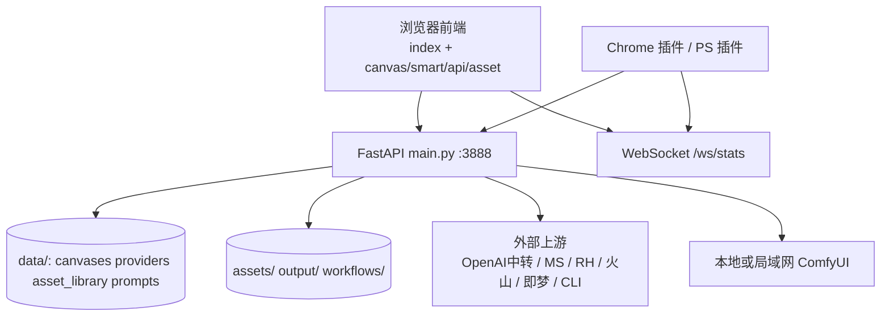

# Infinite-Canvas 项目功能分析

> 文档版本：与代码同步参考版本 `2026.08.04`  
> 分析范围：根目录源码、`static/` 前端、`tools/` 插件、`workflows/`、配置与数据目录  
> 目的：支持二次开发前的功能摸底、外部依赖梳理、资产库设计理解

---

## 1. 项目定位

Infinite-Canvas 是一个**本地运行的 AI 创作工作台**：

- 后端：Python + FastAPI（入口 `main.py`，默认端口 `3888`）
- 前端：静态 HTML/JS 多页面，由 `static/index.html` 以 iframe 组合
- 形态：本机或局域网 Web 应用（`http://127.0.0.1:3888/` / `http://局域网IP:3888/`）

核心价值：

1. **多上游聚合**：同一套 UI 可接 OpenAI 兼容中转、ModelScope、RunningHub、火山引擎、即梦 CLI、Codex/Gemini CLI、本地 ComfyUI
2. **双画布工作流**：普通节点画布 + 智能卡片画布
3. **本地数据主权**：密钥、画布、素材、历史均落本地磁盘
4. **插件生态**：Chrome 采集插件、Photoshop UXP 资产连接器

许可约束（README）：

- 允许个人与公司自用
- 禁止修改封装成商业产品；商用需授权
- 基于代码二次开发的软件须保持开源并注明原作者

---

## 2. 仓库结构速览

```text
Infinite-Canvas/
├── main.py                 # 单体后端（约 1.9 万行，160+ 路由）
├── requirements.txt        # fastapi/uvicorn/requests/pydantic/httpx/pillow...
├── VERSION                 # 本地版本号（用于更新提示）
├── API/.env                # API Key / CLI 相关环境变量（勿提交公开）
├── data/                   # 运行时元数据
│   ├── asset_library.json
│   ├── api_providers.json
│   ├── canvases/
│   ├── conversations/
│   └── ...
├── assets/                 # 媒体文件
│   ├── input/              # 上传/参考输入
│   ├── output/             # 生成结果
│   ├── library/            # 正式资产库文件
│   └── uploads/            # 本地素材（插件采集等）
├── workflows/              # 预置/自定义 ComfyUI 工作流 JSON
├── static/                 # 前端页面与资源
├── tools/
│   ├── chrome-local-asset-importer/
│   └── photoshop-asset-connector/
├── CLI/                    # Codex / Gemini / 即梦 CLI 安装登录脚本
├── packages/               # 离线 wheel（便携安装）
└── python/                 # 便携 Python（整包分发时）
```

技术栈摘要：

| 层 | 技术 |
|----|------|
| 后端 | Python 3.10+、FastAPI、Uvicorn、httpx/requests、Pillow |
| 前端 | 原生 JS + 静态 HTML/CSS；Tailwind CDN、Lucide、部分 Three.js |
| 实时 | WebSocket `/ws/stats` |
| 持久化 | JSON 文件 + 本地目录（无独立业务数据库） |

---

## 3. 功能全景

### 3.1 主界面导航

入口页：`static/index.html`

| 入口 | 对应页面/能力 |
|------|----------------|
| Z-Image / Enhance / Klein / Angle / Online | 单页快捷工作室（文生图、增强、角度、在线生图等） |
| GPT 对话 | 多轮对话 / Agent / 流式输出 |
| 无限画布 | 画布列表 → 普通节点画布 / 智能画布 |
| 素材库 | 独立资产库管理 |
| API 设置 | 多 Provider、协议、模型、Key |
| ComfyUI 设置 | 后端实例地址 + 工作流导入与参数暴露 |

### 3.2 普通无限画布（节点式）

定位：复杂链路编排，类似轻量节点编辑器。

常见节点类型：

- 图片节点、提示词节点、输出节点
- API 生图 / 视频节点
- ModelScope 节点
- ComfyUI 节点（内置工作流 + 自定义 API JSON）
- RunningHub 节点（AI 应用 / 工作流）
- LLM 节点（文本 + 识图）
- 循环节点（批量变体 / 并发生成）

图片/媒体编辑能力：

- 预览、对比、裁剪
- 遮罩 / 画笔局部编辑
- 扩图（outpaint）
- 多宫格切图
- 视频帧抽取
- 360 全景预览截图

### 3.3 智能画布（卡片式）

定位：降低连线成本，适合灵感板、快速改图、团队低门槛使用。

能力要点：

- 拖入图片/视频/素材后直接选平台运行
- `@` 引用资产库或输入图
- 循环卡片批量生成
- 工作流导入导出，支持导出到资产库
- MiniMax 时间线导出（依赖本机 `ffmpeg`）
- 全局预览等快捷操作

### 3.4 对话与 LLM

后端路由示例：

- `POST /api/chat`
- `POST /api/chat/stream`
- `POST /api/chat/agent`
- 会话 CRUD：`/api/conversations*`

能力：

- 多会话本地持久化（`data/conversations/`）
- 文本对话、图片理解（需 VL 模型）、提示词反推、Agent 模式
- 可走 OpenAI / Gemini / ModelScope / RunningHub LLM / Codex CLI / Gemini CLI 等

### 3.5 项目与画布管理

- 项目分组（`/api/projects*`）
- 多画布创建/保存/元数据/回收站（约 30 天软删除）
- 画布资源检查与打包下载
- 工作流 zip 导入导出
- WebSocket 广播：
  - `stats`（在线人数）
  - `canvas_updated`
  - `asset_library_updated`
  - `new_image`

### 3.6 ComfyUI 集成

- 多实例地址配置（本机/局域网）
- 工作流列表、上传、配置、删除、运行
- 预置示例：`workflows/` 下 Z-Image、Enhance、Flux2-Klein、MiniMax_H3、LTXDirector 等
- 自定义工作流：ComfyUI 导出 API JSON → 项目识别可暴露参数 → 画布节点调用

### 3.7 周边工具

#### Chrome 本地素材导入插件（`tools/chrome-local-asset-importer/`）

- 扫描当前页图片/视频（含 blob、data、iframe、canvas、网络嗅探）
- 批量导入到 `assets/uploads/`
- 可选导入后智能分类
- 也可不连后端，直接下载到浏览器目录

#### Photoshop UXP 插件（`tools/photoshop-asset-connector/`）

- 浏览资产库并置入当前文档
- 当前文档导出 PNG 写回资产分组
- WebSocket 实时刷新
- 通过局域网 `IP:端口` 连接后端

### 3.8 运维与体验

- 版本检测与一键更新（GitHub + ModelScope 双源，可备份回滚）
- 存储目录可配置（上传 / 生成 / 本地素材）
- 媒体缩略图代理（`/api/media-preview`）
- 历史记录、任务队列状态
- 中英文切换、深浅色主题

---

## 4. 外部 API 与依赖

### 4.1 总原则

| 场景 | 是否需要外网/外部服务 |
|------|------------------------|
| 打开本地 UI、编辑画布、管理素材 | 否 |
| 仅使用本地 ComfyUI 生成 | 否（需本机/局域网 ComfyUI） |
| API / ModelScope / RunningHub / 火山 / 即梦 / CLI 模型 | 是 |
| 视频/参考图“公网化”、在线更新 | 通常需要 |

**本项目没有统一的官方生成 SaaS 后端**；它是本地聚合器，账号、额度、计费都在各上游平台。

密钥与配置主要位置：

- `API/.env`
- `data/api_providers.json`
- `global_config.json`（兼容旧数据）

### 4.2 支持的 Provider 协议

代码中的协议集合：

```text
openai | apimart | gemini | gemini-cli | volcengine | runninghub | jimeng | codex
```

图片请求模式：

```text
openai | openai-json | openai-video-proxy | openai-responses | tudou-async
```

含义简述：

| 协议/模式 | 说明 |
|-----------|------|
| `openai` | 标准 OpenAI 兼容（聊天/生图常见中转） |
| `apimart` | APIMart 风格异步任务（提交 + 轮询） |
| `gemini` | Gemini 原生协议（v1beta / x-goog-api-key 等） |
| `openai-responses` | Responses/RS：后台任务或 SSE，缓解长耗时 524 |
| `openai-video-proxy` | 以 videos 任务接口承载异步生图/视频类调用 |
| `volcengine` | 火山方舟 |
| `runninghub` | RunningHub 专用 |
| `jimeng` | 即梦 CLI |
| `codex` / `gemini-cli` | 本机 CLI 封装 |

### 4.3 外部服务清单

| 服务 | 用途 | 需要配置 | 是否必须 |
|------|------|----------|----------|
| OpenAI 兼容中转 | 图 / 视频 / LLM | Base URL + API Key | 否（常用主路径） |
| ModelScope | 免费图 / LLM / VL / LoRA | Token（常需阿里云实名） | 否（免费学习首选） |
| RunningHub | 云端工作流、AI 应用、收费模型 | API Key（积分/余额） | 否 |
| 火山引擎 Ark | 图 / 视频 | ARK_API_KEY、AK/SK、Project、Region | 否 |
| 即梦 CLI（dreamina） | 文/图生图、文/图生视频 | 安装 CLI + 登录 | 否 |
| OpenAI Codex CLI | 聊天 / gpt-image-2 等 | 本机 `codex` 登录 | 否 |
| Gemini / Antigravity CLI | CLI 侧 Gemini | 本机 CLI 登录 | 否 |
| 本地/局域网 ComfyUI | 自定义工作流 | `host:port` | 否 |
| GitHub / ModelScope 仓库 | 版本检查、一键更新 | 外网访问 | 仅更新时 |
| 临时图床（Litterbox / temp.sh 等） | 本地媒体换公网 URL | 外网 | 视频/部分参考图路径常需要 |
| ffmpeg | MiniMax 时间线导出 | 本机可执行文件 | 仅该功能 |

### 4.4 代码中的默认上游地址（摘录）

| 服务 | 默认地址 |
|------|----------|
| ModelScope 推理 | `https://api-inference.modelscope.cn/v1` |
| RunningHub | `https://www.runninghub.ai`、OpenAPI v2、`https://llm.runninghub.ai/v1` |
| 火山方舟 | `https://ark.cn-beijing.volces.com/api/v3` |
| 即梦 CLI 安装 | `https://jimeng.jianying.com/cli` |
| 更新源 | GitHub `hero8152/Infinite-Canvas` + ModelScope Studio 镜像 |

README 另推荐可用中转注册页（社区维护，可能变更）：

- `https://apib.ai/...`
- `https://www.fhl.mom/...`
- 教程中亦出现 APIMart 等配置示例

### 4.5 二次开发时的外部依赖注意点

1. **协议分叉多**：同一“生图”在 OpenAI 同步、异步 task、Responses、Gemini、RunningHub、即梦 CLI 上的请求/轮询形态不同，改生成链路需先定协议。
2. **本地路径不能直传多数云 API**：视频和部分参考图会走“上传云端/图床/公网 base URL”转换。
3. **Avatar 注册目前只接了部分平台**（代码中可见 `apimart`、`volcengine`）。
4. **Key 不要写进前端**；前端拿的是脱敏后的 provider 公开信息。
5. **更新器会访问 GitHub/ModelScope**；内网环境需考虑禁用或镜像。

---

## 5. 资产库设计

### 5.1 是否有资产库？

**有，而且是一等公民功能**，不是简单附件目录。

它贯穿：

- 独立素材库页面
- 普通/智能画布侧栏
- 提示词库（并行体系）
- Chrome / Photoshop 插件
- WebSocket 多端刷新

### 5.2 两套素材体系

| 体系 | 元数据 | 文件目录 | 定位 |
|------|--------|----------|------|
| 正式资产库 Asset Library | `data/asset_library.json` | `assets/library/<分组dir>/` | 跨画布复用的正式库 |
| 本地素材 Local Assets | 扫描目录生成树 | `assets/uploads/` | 采集、临时、插件导入 |

相关目录还有：

- `assets/input`：通用上传/参考输入
- `assets/output`：生成输出
- 共享文件夹：`data/shared_folders.json`（挂载本机目录浏览后再导入）

存储根路径可通过 `data/storage_settings.json` 覆盖（upload / generated / local）。

### 5.3 正式资产库数据模型

`data/asset_library.json` 逻辑结构：

```json
{
  "active_library_id": "default",
  "libraries": [
    {
      "id": "default",
      "name": "默认资产库",
      "type": "asset",
      "categories": [
        {
          "id": "characters",
          "name": "角色",
          "type": "image",
          "dir": "角色",
          "items": []
        },
        {
          "id": "scenes",
          "name": "场景",
          "type": "image",
          "dir": "场景",
          "items": []
        },
        {
          "id": "workflows",
          "name": "工作流",
          "type": "workflow",
          "items": []
        }
      ]
    }
  ],
  "categories": [],
  "updated_at": 0
}
```

层级：

```text
libraries[]                # 多个资产库
  └── categories[]         # 分组（image / workflow 等）
        └── items[]        # 素材项
```

item 典型字段：

| 字段 | 说明 |
|------|------|
| `id` | 如 `asset_xxx` |
| `name` | 显示名 |
| `url` | 如 `/assets/library/角色/lib_xxx_name.png` |
| `kind` | `image` / `video` / `audio` / `workflow` |
| `created_at` | 毫秒时间戳 |

设计要点：

1. **多库 + 多分组 + 条目** 三级结构
2. 分组可对应真实子目录（`dir`），启动时会做目录归拢迁移
3. 入库通常 **copy** 到 `assets/library`，删除库内项不必然删除 `/output` 原图
4. 兼容旧版扁平 `categories` 字段
5. `updated_at` + WS `asset_library_updated` 做多端失效刷新

### 5.4 资产库主要 API

| 方法 | 路径 | 作用 |
|------|------|------|
| GET | `/api/asset-library` | 读取完整库 |
| POST | `/api/asset-library/libraries` | 新建库 |
| PATCH/DELETE | `/api/asset-library/libraries/{id}` | 重命名/删除库 |
| POST | `/api/asset-library/categories` | 新建分组 |
| PATCH/DELETE | `/api/asset-library/categories/{id}` | 重命名/删除分组 |
| POST | `/api/asset-library/items` | 添加条目 |
| POST | `/api/asset-library/items/batch` | 批量添加 |
| PATCH | `/api/asset-library/items/{id}` | 重命名 |
| DELETE / POST delete | `/api/asset-library/items...` | 删除/批量删除 |
| POST | `/api/asset-library/items/move` | 批量移动 |
| POST | `/api/asset-library/items/crop` | 批量裁剪 |
| POST | `/api/asset-library/items/classify` | 智能分类 |
| POST | `/api/asset-library/items/{id}/register-avatar` | 角色头像注册 |
| POST | `/api/asset-library/workflows/upload` | 工作流资产上传 |
| POST | `/api/canvas-workflows/export-to-library` | 画布工作流导出到库 |

本地素材并行 API 前缀：`/api/local-assets*`（上传、目录树、改名、移动、删除、caption、classify）。

提示词库并行 API 前缀：`/api/prompt-libraries*`，数据文件 `data/prompt_libraries.json`。

### 5.5 前端与插件接入

| 端 | 文件/位置 | 作用 |
|----|-----------|------|
| 素材库页 | `static/asset-manager.html` + `js/asset-manager.js` | 完整管理 UI |
| 普通画布 | `static/canvas.html` + `js/canvas.js` | 侧栏资产、管理弹窗 |
| 智能画布 | `static/smart-canvas.html` + `js/smart-canvas.js` | 侧栏资产、`@` 引用 |
| Chrome 插件 | `tools/chrome-local-asset-importer/` | 网页采集 → uploads |
| PS 插件 | `tools/photoshop-asset-connector/` | 资产 ↔ PS 双向 |

### 5.6 智能能力

- **智能分类**：调用已配置的多模态/LLM，结果可写旁路 `.classification.json`
- **本地 caption**：对 uploads 素材生成描述文本
- **Avatar 注册**：把角色图登记到支持的上游平台资产体系（当前可见 apimart / volcengine）
- **缩略图代理**：大图/视频先经 `/api/media-preview` 降分辨率，减轻前端滚动压力

### 5.7 设计评价（二次开发视角）

优点：

- 元数据 JSON + 文件目录双轨，备份迁移直观
- 正式库 / 本地 uploads / 共享文件夹职责可分
- 与画布、工作流、插件、WS 同步已打通

局限：

- 无独立 DB / 全文检索 / 向量检索，素材量很大时 JSON + 扫盘会吃力
- 正式库与“本地素材”双入口，产品语义需要文档或 UI 继续收敛
- 分类与头像强依赖外部模型与平台能力
- 业务逻辑高度集中在 `main.py`，资产模块尚未物理拆分

可演进方向（建议，非当前实现）：

1. 资产索引表（SQLite）+ 保留文件实体
2. 标签/语义检索
3. 统一“素材源”抽象（library / uploads / shared / canvas-output）
4. 将 asset/provider/canvas 从 `main.py` 拆成包

---

## 6. 架构示意



数据流简述：

1. 用户在前端配置 Provider 并保存 → 写 `api_providers.json` / `API/.env`
2. 画布发起生成 → 后端按协议转发上游或 ComfyUI / CLI
3. 结果落 `assets/output` 或远程 URL，再回写画布 JSON
4. 用户可把结果/采集物写入资产库或本地 uploads
5. 资产变更广播 WS，其他页面/插件刷新

---

## 7. 关键运行时路径

| 路径 | 内容 |
|------|------|
| `API/.env` | 各平台 Key、即梦/CLI 相关变量 |
| `data/api_providers.json` | Provider 列表与模型勾选 |
| `data/asset_library.json` | 正式资产库元数据 |
| `data/prompt_libraries.json` | 提示词库 |
| `data/canvases/` | 画布文档 |
| `data/conversations/` | 会话 |
| `data/runninghub_workflows.json` | RH 工作流缓存/配置 |
| `data/shared_folders.json` | 共享文件夹注册 |
| `data/storage_settings.json` | 存储根目录覆盖 |
| `assets/library/` | 正式资产文件 |
| `assets/uploads/` | 本地素材文件 |
| `assets/input/`、`assets/output/` | 输入/生成 |
| `workflows/` | Comfy 工作流 |
| `history.json` | 历史记录 |
| `VERSION` | 本地版本 |

个人数据迁移时，文档与教程建议优先保留：

```text
API/
data/
assets/
output/
workflows/custom/   # 若存在自定义目录
```

---

## 8. 功能总表（速查）

| 领域 | 能力 | 外部依赖 |
|------|------|----------|
| 普通画布 | 节点编排、循环、编辑器 | 视节点而定 |
| 智能画布 | 卡片创作、@ 素材、工作流进出 | 视生成源而定 |
| API 生图/视频 | 多协议中转 | 是 |
| ModelScope | 免费图/LLM/VL/LoRA | 是 |
| RunningHub | 云工作流/应用/模型 | 是 |
| 火山引擎 | 图/视频 | 是 |
| 即梦 CLI | 图/视频权益调用 | CLI + 登录 |
| Codex / Gemini CLI | 本机 CLI 模型 | CLI + 登录 |
| ComfyUI | 本地/局域网工作流 | 本机服务 |
| 资产库 | 多库分组、分类、工作流资产 | 分类/头像时需要模型 |
| 本地素材 | 上传/插件采集/目录管理 | 采集源网页 |
| 提示词库 | 系统+用户模板 | 否 |
| GPT 对话 | 会话/流式/Agent | 是（除非本地 LLM 源） |
| 更新器 | 检查/下载/回滚 | GitHub 或 ModelScope |
| PS / Chrome 插件 | 资产与采集闭环 | 连本地后端 |

---

## 9. 二次开发切入建议

按杠杆从高到低：

1. **Provider 适配层**  
   统一协议、模型目录、任务轮询、错误码与计费提示；这是最多外部 API 分叉点。

2. **资产域拆分**  
   将 `asset-library` / `local-assets` / `prompt-libraries` / shared folders 抽成模块，并评估 SQLite 索引。

3. **画布文档模型**  
   普通画布与智能画布的节点/卡片 schema、导入导出兼容策略。

4. **前端工程化**  
   当前超大 JS（如 `smart-canvas.js`）适合逐步拆模块；先别大改交互协议。

5. **插件契约稳定**  
   PS/Chrome 已依赖 `/api/asset-library`、`/api/local-assets`、`/ws/stats` 等，改接口需同步插件。

---

## 10. 一句话结论

| 维度 | 结论 |
|------|------|
| 产品 | 本地 AI 无限画布 + 多平台生成聚合器 |
| 功能 | 双画布、多模态生成、工作流、对话、素材/提示词库、插件 |
| 外部 API | **大量可选依赖**；不做云端生成可不上网，真生产至少配置 1 个上游 |
| 资产库 | **有完整设计**：多库多分组、文件落地、智能分类、工作流资产、WS 同步、Chrome/PS 接入 |
| 架构风险 | `main.py` 单体过大；持久化偏 JSON 文件 |
| 二次开发前提 | 先稳住 Provider 与资产/画布数据契约，再拆模块 |

---

## 11. 相关文档与入口

| 资源 | 说明 |
|------|------|
| `README.md` | 功能列表、许可、更新说明 |
| `新手运行与使用教程.md` | 安装、各平台配置、画布与素材用法 |
| `MAC-使用说明.md` | macOS 启动与权限 |
| `CLI/README.md` | Codex / Gemini / 即梦 CLI 脚本 |
| `tools/*/README.md` | 插件安装与接口契约 |
| 视频教程 | README / 新手教程中的 B 站、YouTube 链接 |

---

*本文档基于当前仓库代码与自带说明整理，供 `feature/secondary-dev` 分支二次开发使用。若上游协议或目录结构变更，请同步修订本节与第 4、5 章。*
